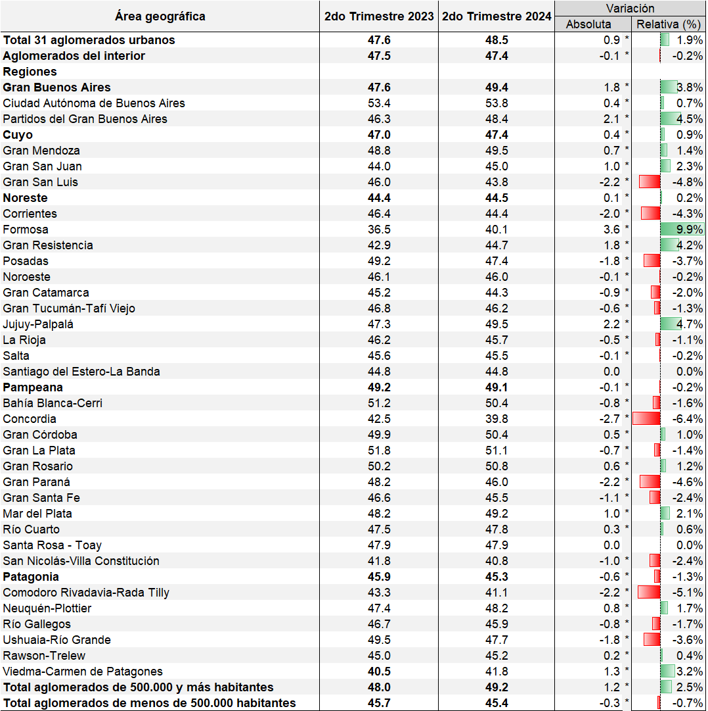

<style>
  p {
    font-size: 22px;
    line-height: 28px;
    width: 950px;
  }

h1, h2, h3, h4, h5, h6, legend {
    font-family: Arial, sans-serif;
    font-weight: 700;
    color: #9F2042;
}
</style>

```{r setup, include=FALSE}
knitr::opts_chunk$set(echo = TRUE)
options(knitr.kable.NA = '')
library(tidyverse)
library(plotly)
library(knitr)
library(readxl)
```

**En el segundo trimestre de 2024, en el total de los 31 aglomerados urbanos capturados por la Encuesta Permanente de Hogares (EPH) la tasa de actividad se estimó en 48.5 por ciento, la tasa de empleo en 44.8 por ciento y la tasa de desocupación en 7.6 por ciento.**

**Figura 1. Principales Tasas del Mercado de Trabajo. Total de Aglomerados**
```{r fig1screenshot, echo=FALSE, fig.cap="Fuente: elaboración propia a partir de la Encuesta Permanente de Hogares (EPH). * Diferencia significativa con p < 0,10. ** Diferencia significativa con p < 0,05. *** Diferencia significativa con p < 0,01.", out.width = '100%'}

```

**Principales Tasas del Mercado de Trabajo (Total de Aglomerados)**

**La tasa de actividad aumentó, en el segundo trimestre de 2024, casi 1 punto porcentual con respecto al segundo trimestre de 2023.** Este aumento es estadísticamente significativo (Cuadro 1) e implicó que alrededor de 400 mil personas ingresaran en la fuerza de trabajo entre el segundo trimestre de 2023 y el segundo de 2024 (Cuadro 2). **El incremento en la tasa de actividad se explica principalmente por lo ocurrido en los aglomerados de más de 500 mil habitantes** donde la tasa aumentó 2.5 por ciento (Cuadro 1). En los aglomerados del interior del país la tasa de actividad cayó 0.3 puntos porcentuales en la comparación interanual. **La Encuesta Permanente de Hogares es una muestra representativa de una población urbana de 29.7 millones de personas al segundo trimestre de 2024, de esa población 14.4 millones integran la población económicamente activa.**

**En el segundo trimestre de 2024, la tasa de empleo aumentó 0.2 puntos porcentuales en el total de aglomerados capturados por la EPH en comparación con el segundo trimestre de 2023.** Como sucedió con la tasa de actividad, esta variación es estadísticamente significativa y está explicada por un aumento de 1.1 por ciento en la tasa de empleo en los aglomerados de más de 500 mil habitantes, mientras que en los aglomerados de menos de 500 mil habitantes la tasa de empleo cayó casi 1 punto porcentual (Cuadro 3).  **Este aumento en la tasa de empleo en el total de aglomerados implicó que alrededor de 190 mil personas se ocuparan entre el segundo trimestre de 2023 y el segundo de 2024** (Cuadro 4). El aumento en la ocupación estuvo asociado al crecimiento del empleo de mujeres mayores de 29 años y hombres mayores de 64 años; en trabajadores con secundaria incompleta y con educación universitaria completa; en trabajadores por cuenta propia, en trabajadores asalariados formales y del sector privado; en trabajadores cuya calificación es técnica o profesional y mayormente en actividades primarias, hoteles y restaurantes, transporte almacenamiento y comunicaciones, servicios sociales y de salud y servicio doméstico (Cuadro 7).

**La tasa de desocupación aumentó 1.4 puntos porcentuales entre el segundo trimestre de 2023 y el segundo de 2024.** A diferencia de la tasa de actividad y la de empleo, **la tasa de desocupación aumentó tanto en los aglomerados de más de 500 mil habitantes como en los de menos de 500 mil habitantes.** En los aglomerados del interior del país la tasa de desocupación aumentó 17.5 por ciento en la comparación interanual (Cuadro 5). **Como consecuencia del aumento en la tasa de desocupación más de 200 mil personas ingresaron en el desempleo entre el segundo trimestre de 2023 y el segundo de 2024** (Cuadro 6). **El número total de desocupados en el total de aglomerados de la EPH en el segundo trimestre de 2024 es de 1.1 millones de personas.** La tasa de desocupación aumentó en términos interanuales en trabajadores que tenían una ocupación anterior, en trabajadores cuya ocupación anterior era de asalariados, trabajadores del sector público y trabajadores con calificación de operativos. Por otro lado, la tasa de desocupación cayó para aquellos trabajadores con educación universitaria, para aquellos que eran no asalariados y no calificados, además de aquellos cuya última ocupación era en el sector de la construcción, industria manufacturera y servicio doméstico (Cuadro 8).  

**Principales Tasas del Mercado de Trabajo por Área Geográfica**

**Región del Gran Buenos Aires:** el aumento tanto en la tasa de actividad como en la de empleo y desempleo se explica principalmente por la situación en los partidos del conurbano bonaerense. En la Ciudad Autónoma de Buenos Aires aumentó más que en los partidos del conurbano la tasa de desocupación y menos la tasa de actividad y cayó casi 1 punto porcentual la tasa de empleo (Cuadros 1, 3 y 5). Esta caída en la tasa de empleo implica que hay alrededor de 11 mil trabajadores ocupados menos que en el segundo trimestre de 2023 (Cuadro 4). En los partidos del Gran Buenos Aires hay alrededor de 570 mil personas desocupadas en el segundo trimestre de 2024, un aumento de casi 30 por ciento comparado con el segundo trimestre de 2023. 

**Región Cuyo:** la tasa de actividad se incrementó 0.4 puntos porcentuales entre el segundo trimestre de 2023 y el segundo de 2024. El aumento fue impulsado por los aglomerados del Gran Mendoza y el Gran San Juan, donde la tasa de actividad aumentó entre 0.7 y 1 punto porcentual. Por otro lado, en el Gran San Luis la tasa de actividad retrocedió 2.2 puntos porcentuales en la comparación interanual (Cuadro 1). La tasa de empleo cayó 0.1 puntos porcentuales entre el segundo trimestre de 2023 y el segundo de 2024 impulsada por la caída de casi 3 puntos porcentuales en el aglomerado del Gran San Luis (Cuadro 3). La tasa de desocupación pasó de 4.1 por ciento en el segundo trimestre de 2023 a 5.1 por ciento en el segundo de 2024. Este aumento fue generalizado en los tres aglomerados que componen la región (Cuadro 5). En el segundo trimestre de 2024 había más de 45 mil personas desocupadas en la región de Cuyo (Cuadro 6).

**Región Noreste:** la tasa de actividad aumentó 0.1 puntos porcentuales entre el segundo trimestre de 2023 y el segundo de 2024. Este aumento, estadísticamente significativo, es un promedio ponderado de incrementos y caídas en la tasa de actividad de los aglomerados que integran la región. Mientras que en los aglomerados de Formosa y Gran Resistencia la tasa de actividad creció 1.8 y 3.6 puntos porcentuales, respectivamente, en los aglomerados de Corrientes y Posadas cayó alrededor de 2 puntos porcentuales (Cuadro 1). La tasa de empleo cayó 1.3 puntos porcentuales en la comparación interanual impulsada por el comportamiento de esta tasa en los aglomerados de Corrientes, Gran Resistencia y Posadas (cuadro 3).  La tasa de desocupación aumentó en todos los aglomerados de la región Noreste pasando de 4.3 por ciento en el segundo trimestre de 2023 a 7.8 por ciento en el segundo de 2024 (Cuadro 5). Este aumento implicó que más de 22 mil personas pasaran a estar desocupadas entre el segundo trimestre de 2023 y el segundo de 2024 (Cuadro 6).

**Región Noroeste:** la tasa de actividad cayó de 46.1 a 46.0 por ciento entre el segundo trimestre de 2023 y el segundo de 2024. Esta caída fue impulsadoa por el comportamiento de la tasa de actividad de los aglomerados de Gran Catamarca, Gran Tucumán-Tafí Viejo, La Rioja y Salta. En Jujuy-Palpalá la tasa de actividad creció 2.2 puntos porcentuales y en Santiago del Estero-La Banda permaneció estable (Cuadro 1). La tasa de empleo cayó 0.2 puntos porcentuales en la comparación interanual. El comportamiento de la tasa de empleo fue heterogéneo en los aglomerados que integran la región, aumentando en Jujuy-Palpalá y Santiego del Estero-La Banda y cayendo en el resto de los aglomerados (Cuadro 3).  La tasa de desocupación aumentó 0.1 puntos porcentuales alcanzando 5.2 por ciento en el segundo trimestre de 2024. Este pequeño aumento fue el resultado de incrementos en los aglomerados de Gran Tucumán-Tafí Viejo, La Rioja y Salta y de caídas en el desempleo en Jujuy-Palpalá y Santiago del Estero-La Banda (Cuadro 5).

**Región Pampeana:** la tasa de actividad cayó 0.1 puntos porcentuales en la comparación interanual impulsada por caídas en la tasa de actividad de los aglomerados de Bahía Blanca-Cerri, Concordia, Gran La Plata, Gran Paraná, Gran Santa Fé y San Nicolás-Villa Constitución (Cuadro 1). La tasa de empleo pasó de 45.9 por ciento en el segundo trimestre de 2023 a 45.4 por ciento en el segundo de 2024. Esta caída en la tasa de empleo se explica por una caída casi generalizada del empleo en todos los aglomerados que integran la región (Cuadro 3). La tasa de desocupación aumentó casi 1 punto porcentual entre el segundo trimestre de 2023 y el segundo de 2024. El aumento fue impulsado por incrementos de la tasa de desocupación en los aglomerados de Bahía Blanca-Cerri, Gran La Plata, Gran Rosario, y Santa Rosa-Toay (Cuadro 5). En esta región el número de desocupados alcanza casi 240 mil personas en el segundo trimestre de 2024 (Cuadro 6).

**Región Patagonia:** La tasa de actividad cayó 1.3 por ciento entre el segundo trimestre de 2023 y el segundo de 2024. El comportamiento de la tasa de actividad fue heterogéneo en los aglomerados que integran la región, aumentando en Neuquén-Plottier, Rawson-Trelew y Viedma-Carmen de Patagones y cayendo en el resto de los aglomerados (Cuadro 1). La tasa de empleo cayó 1 punto porcentual en la comparación interanual impulsada por caídas del empleo en Comodorao Rivadavia-Rada Tilly, Río Gallegos, Ushuaia-Río Grande y Rawson-Trelew  (Cuadro 3). La tasa de desocupación pasó de 4.3 por ciento en el segundo trimestre de 2023 a 5.4 por ciento en el segundo trimestre de 2024. El aumento de la desocupación se dió en casi todos los aglomerados de la región con la única excepción del aglomerado Viedma-Carmen de Patagones donde la tasa de desocupación cayó 0.2 puntos porcentuales (Cuadro 5). 


**Cuadro 1: evolución de la tasa de actividad por aglomerado**
```{r fig2screenshot, echo=FALSE, fig.cap="Nota: * indica que la variación es estadísticamente significativa al 5%.", out.width = '100%'}

```

**Cuadro 2: personas que pertenecen a la fuerza de trabajo**
```{r fig3screenshot, echo=FALSE, fig.cap="Nota: * indica que la variación es estadísticamente significativa al 5%.", out.width = '100%'}

```


**Cuadro 3: evolución de la tasa de empleo por aglomerado**
```{r fig23screenshot, echo=FALSE, fig.cap="Nota: * indica que la variación es estadísticamente significativa al 5%.", out.width = '100%'}

```

**Cuadro 4: personas ocupadas**
```{r fig24screenshot, echo=FALSE, fig.cap="Nota: * indica que la variación es estadísticamente significativa al 5%.", out.width = '100%'}

```


**Cuadro 5: evolución de la tasa de desocupación por aglomerado**
```{r fig25screenshot, echo=FALSE, fig.cap="Nota: * indica que la variación es estadísticamente significativa al 5%.", out.width = '100%'}

```

**Cuadro 6: personas desempleadas**
```{r fig26screenshot, echo=FALSE, fig.cap="Nota: * indica que la variación es estadísticamente significativa al 5%.", out.width = '100%'}

```


**Cuadro 7: características de las personas ocupadas**
```{r fig27screenshot, echo=FALSE, fig.cap="Nota: * indica que la variación es estadísticamente significativa al 5%.", out.width = '100%'}

```

**Cuadro 8: características de las personas desocupadas**
```{r fig28screenshot, echo=FALSE, fig.cap="Nota: * indica que la variación es estadísticamente significativa al 5%.", out.width = '100%'}

```

